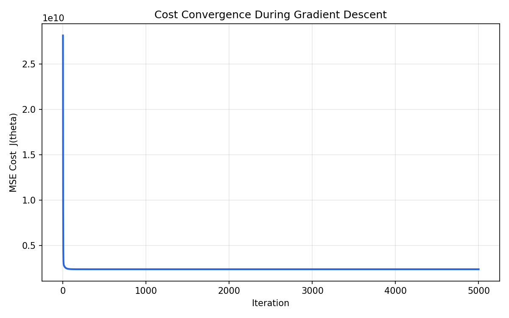
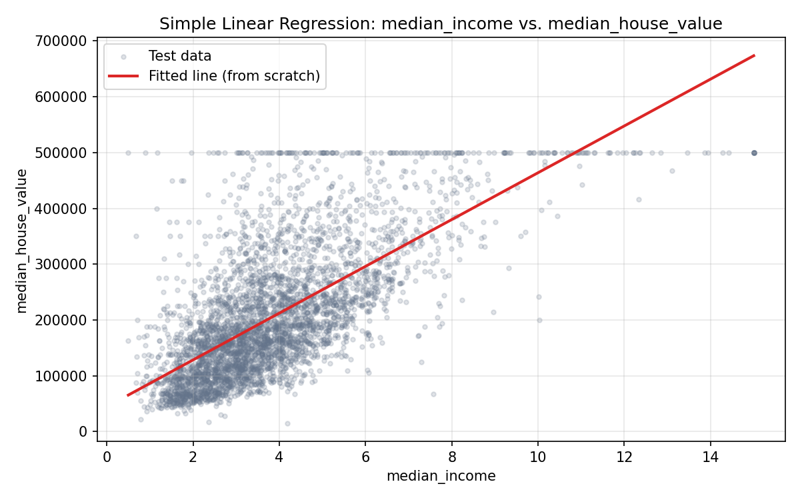

# ML Fundamentals — Linear Regression From Scratch

A complete, from-scratch implementation of **Linear Regression** using only
**NumPy** — no `sklearn.linear_model.LinearRegression` is used anywhere in
the actual model. Scikit-learn is used *only* for `train_test_split` and as
a final independent sanity check, exactly as permitted by the task brief.

---

## Table of Contents

1. [Project Overview](#1-project-overview)
2. [Objective](#2-objective)
3. [Dataset](#3-dataset)
4. [Technologies Used](#4-technologies-used)
5. [Project Structure](#5-project-structure)
6. [Linear Regression Mathematics](#6-linear-regression-mathematics)
7. [Hypothesis Function](#7-hypothesis-function)
8. [MSE Cost Function](#8-mse-cost-function)
9. [Gradient Derivation](#9-gradient-derivation)
10. [Gradient Descent Update Rule](#10-gradient-descent-update-rule)
11. [Feature Standardization](#11-feature-standardization)
12. [Train/Test Split](#12-traintest-split)
13. [Training Process](#13-training-process)
14. [Cost Convergence](#14-cost-convergence)
15. [Manual MSE Calculation](#15-manual-mse-calculation)
16. [Manual R² Calculation](#16-manual-r²-calculation)
17. [Scikit-learn Comparison](#17-scikit-learn-comparison)
18. [Final Results](#18-final-results)
19. [How to Install](#19-how-to-install)
20. [How to Run the Project](#20-how-to-run-the-project)
21. [Key Learnings](#21-key-learnings)
22. [Limitations](#22-limitations)
23. [Conclusion](#23-conclusion)

---

## 1. Project Overview

This project implements **Linear Regression entirely from first principles**
using NumPy matrix operations — the hypothesis function, the Mean Squared
Error (MSE) cost function, the gradient, and Gradient Descent are all
written by hand. The model is trained on a real-world dataset and evaluated
with manually implemented metrics (MSE and R²), then cross-checked against
scikit-learn's `LinearRegression` to confirm correctness.

## 2. Objective

- Understand and implement the mathematics behind Linear Regression, rather
  than treating it as a black box.
- Build both **Simple Linear Regression** (1 feature) and **Multiple Linear
  Regression** (many features) using the *same* underlying class.
- Train the model with manual batch Gradient Descent and visualize
  convergence.
- Evaluate performance with hand-written MSE/R² functions.
- Validate the from-scratch implementation against scikit-learn's
  closed-form solution.

## 3. Dataset

**California Housing Dataset** (the classic StatLib / Pace & Barry, 1997
version — the same dataset popularized by Aurélien Géron's *Hands-On
Machine Learning*). It contains **20,640 rows** describing housing blocks in
California from the 1990 census, with a continuous numeric target,
`median_house_value`.

The CSV is included directly in this repository at `data/dataset.csv` so
the project is **fully reproducible offline** — no external download or API
key is required at run time.

**Columns:**

| Column | Description |
|---|---|
| `longitude`, `latitude` | Geographic location of the housing block |
| `housing_median_age` | Median age of houses in the block |
| `total_rooms`, `total_bedrooms` | Total rooms / bedrooms in the block |
| `population`, `households` | Population and number of households |
| `median_income` | Median income of households (in tens of thousands) |
| `median_house_value` | **Target** — median house value (USD) |
| `ocean_proximity` | Categorical distance-to-ocean label (not used — see [Limitations](#22-limitations)) |

**Data cleaning performed with Pandas:**
- `total_bedrooms` had **207 missing values** out of 20,640 rows.
- Missing values were imputed with the **column median** (robust to the
  right-skewed distribution of room counts).
- All other numeric columns had zero missing values (verified with
  `df.isnull().sum()`).

## 4. Technologies Used

| Tool | Purpose |
|---|---|
| **NumPy** | All core mathematics — hypothesis, cost, gradients, Gradient Descent, manual MSE/R² |
| **Pandas** | Loading, inspecting, and cleaning the dataset |
| **Matplotlib** | Cost-convergence plot and regression visualization |
| **scikit-learn** | `train_test_split` **only**, plus a final `LinearRegression` sanity check |

## 5. Project Structure

```
linear-regression-from-scratch/
│
├── data/
│   └── dataset.csv                 # California Housing dataset (20,640 rows)
│
├── src/
│   ├── linear_regression.py        # Core from-scratch model (hypothesis, cost, gradient, fit, predict)
│   ├── train.py                    # Load → clean → split → scale → train → plot → save artifacts
│   ├── evaluate.py                 # Manual MSE/R² + scikit-learn comparison
│   └── simple_demo.py              # Simple (single-feature) regression demo
│
├── results/
│   ├── cost_convergence.png        # Cost vs. iteration plot (multiple regression)
│   ├── simple_regression_plot.png  # Fitted line for simple regression demo
│   └── artifacts.npz               # Saved model/scaler/split (regenerated by train.py; gitignored)
│
├── README.md
├── requirements.txt
└── .gitignore
```

## 6. Linear Regression Mathematics

Linear Regression models a continuous target `y` as a linear combination of
input features `X`, parameterized by a weight vector `theta`:

```
y ≈ h(X) = theta_0 + theta_1*x_1 + theta_2*x_2 + ... + theta_n*x_n
```

`theta_0` is folded into the matrix form by prepending a column of 1s to
`X`, giving the compact hypothesis in [Section 7](#7-hypothesis-function).

## 7. Hypothesis Function

```
h(X) = X · theta
```

Implemented in [`linear_regression.py`](src/linear_regression.py) as:

```python
def hypothesis(self, X_with_bias):
    return X_with_bias @ self.theta
```

`X_with_bias` has shape `(m, n+1)` (a leading column of ones for the
intercept), and `theta` has shape `(n+1, 1)`, so `h(X)` has shape `(m, 1)` —
one prediction per training example. This single vectorized expression
handles both **simple** regression (`n = 1`) and **multiple** regression
(`n > 1`) identically.

## 8. MSE Cost Function

```
J(theta) = (1 / 2m) * Σ ( h(x_i) − y_i )²
```

```python
def compute_cost(self, X_with_bias, y):
    m = X_with_bias.shape[0]
    errors = self.hypothesis(X_with_bias) - y
    return float((1 / (2 * m)) * np.sum(errors ** 2))
```

The `1/2` factor is a convenience that cancels the `2` produced when the
square is differentiated (see below), yielding a cleaner gradient.

## 9. Gradient Derivation

Differentiating `J(theta)` with respect to `theta` (using the chain rule on
the squared-error term) gives:

```
∂J/∂theta = (1 / m) * Xᵀ · ( h(X) − y )
```

```python
def compute_gradient(self, X_with_bias, y):
    m = X_with_bias.shape[0]
    errors = self.hypothesis(X_with_bias) - y
    return (1 / m) * (X_with_bias.T @ errors)
```

This single matrix multiplication computes the partial derivative with
respect to **every** parameter (intercept and all coefficients)
simultaneously — no Python loops over features are needed.

## 10. Gradient Descent Update Rule

Each iteration nudges `theta` a small step in the direction that reduces
the cost:

```
theta := theta − alpha * ∂J/∂theta
```

where `alpha` is the learning rate. The full loop in `fit()`:

1. Compute predictions — `hypothesis()`
2. Compute cost — `compute_cost()` (stored in `cost_history`)
3. Compute gradients — `compute_gradient()`
4. Update parameters — `theta -= alpha * gradient`
5. Repeat for `n_iterations`

```python
for _ in range(self.n_iterations):
    cost = self.compute_cost(X_with_bias, y)
    self.cost_history.append(cost)
    gradient = self.compute_gradient(X_with_bias, y)
    self.theta = self.theta - self.learning_rate * gradient
```

## 11. Feature Standardization

Features are standardized (zero mean, unit variance):

```
x_scaled = (x − mean) / std
```

This is essential for Gradient Descent: features like `total_rooms`
(thousands) and `housing_median_age` (tens) live on very different scales,
which otherwise causes uneven, slow, or unstable convergence. The scaler's
`mean` and `std` are computed **only on the training set** and then applied
to both train and test sets, to avoid leaking test-set information into
training.

## 12. Train/Test Split

An 80/20 split is created with `sklearn.model_selection.train_test_split`
(explicitly permitted by the task for this step):

```python
X_train, X_test, y_train, y_test = train_test_split(
    X, y, test_size=0.2, random_state=42
)
```

- **Train set:** 16,512 rows
- **Test set:** 4,128 rows

`random_state=42` makes the split — and therefore every downstream result —
fully reproducible.

## 13. Training Process

The multiple-regression model (`src/train.py`) is trained on all 8 numeric
features with:

- **Learning rate (`alpha`):** 0.3
- **Iterations:** 5,000
- **Parameter initialization:** small random values (`N(0, 0.01)`), seeded
  with `random_state=42` for reproducibility

```bash
python src/train.py
```

## 14. Cost Convergence

The cost drops steeply within the first ~50 iterations and then flattens
smoothly as `theta` approaches the minimum — the expected signature of
correctly implemented Gradient Descent on a convex (MSE) cost surface.



| Iteration | MSE Cost |
|---|---:|
| 1 (initial) | 28,148,711,354.76 |
| 5,000 (final) | 2,405,567,198.94 |

## 15. Manual MSE Calculation

Implemented with pure NumPy — **no** `sklearn.metrics.mean_squared_error`:

```
MSE = (1 / m) * Σ ( y_true − y_pred )²
```

```python
def mean_squared_error_manual(y_true, y_pred):
    m = y_true.shape[0]
    return float((1 / m) * np.sum((y_true - y_pred) ** 2))
```

## 16. Manual R² Calculation

Implemented with pure NumPy — **no** `sklearn.metrics.r2_score`:

```
R² = 1 − (SS_res / SS_tot)

SS_res = Σ ( y_true − y_pred )²
SS_tot = Σ ( y_true − mean(y_true) )²
```

```python
def r2_score_manual(y_true, y_pred):
    ss_res = np.sum((y_true - y_pred) ** 2)
    ss_tot = np.sum((y_true - np.mean(y_true)) ** 2)
    return float(1 - (ss_res / ss_tot))
```

## 17. Scikit-learn Comparison

For final verification only, `sklearn.linear_model.LinearRegression` is
trained on the **exact same** standardized train/test split (loaded from
the artifacts saved by `train.py`), and compared against the from-scratch
model using the same manual MSE/R² functions.

With enough Gradient Descent iterations on a convex cost surface, batch
Gradient Descent converges to the same optimum as the closed-form Normal
Equation solution scikit-learn uses internally — which is exactly what we
observe below.

## 18. Final Results

*(Actual output from running `python src/train.py` then
`python src/evaluate.py` on this repository, 80/20 split, `random_state=42`.)*

| Metric   | From Scratch | Scikit-learn |
| -------- | -----------: | -----------: |
| Test MSE | 5,059,928,371.13 | 5,059,928,371.17 |
| Test R²  | 0.613866 | 0.613866 |
| Train MSE | 4,811,134,397.88 | 4,811,134,397.88 |
| Train R² | 0.640095 | 0.640095 |
| Intercept | 207,194.6937 | 207,194.6937 |

**Coefficient comparison** (on standardized features):

| Feature | From Scratch | Scikit-learn | Abs. Diff |
|---|---:|---:|---:|
| longitude | -85,503.2182 | -85,503.2182 | 0.000000 |
| latitude | -90,698.8488 | -90,698.8488 | 0.000000 |
| housing_median_age | 14,905.9064 | 14,905.9064 | 0.000000 |
| total_rooms | -17,805.4185 | -17,805.4185 | 0.000001 |
| total_bedrooms | 48,712.3433 | 48,712.3433 | 0.000005 |
| population | -43,766.4912 | -43,766.4912 | 0.000001 |
| households | 17,654.5007 | 17,654.5007 | 0.000005 |
| median_income | 77,194.6995 | 77,194.6995 | 0.000000 |

Mean absolute difference between the two models' test-set predictions:
**0.0000** (max: 0.0000) — i.e. the from-scratch Gradient Descent solution
and scikit-learn's closed-form solution are numerically indistinguishable
to the precision printed.

**Simple Linear Regression demo** (single feature: `median_income`,
`python src/simple_demo.py`):

| Metric | Value |
|---|---:|
| Intercept | 207,194.6937 |
| Coefficient (median_income) | 79,851.9564 |
| Test MSE | 7,091,157,771.77 |
| Test R² | 0.458859 |



As expected, the single-feature model explains noticeably less variance
(R² ≈ 0.46) than the 8-feature multiple regression model (R² ≈ 0.61),
since `median_income` alone doesn't capture location or house-size effects.

## 19. How to Install

```bash
git clone <your-repo-url>
cd linear-regression-from-scratch
python -m venv venv
source venv/bin/activate        # On Windows: venv\Scripts\activate
pip install -r requirements.txt
```

## 20. How to Run the Project

```bash
# 1. Train the multiple-regression model (also saves artifacts.npz + cost plot)
python src/train.py

# 2. Evaluate it manually and compare against scikit-learn
python src/evaluate.py

# 3. (Optional) Run the simple linear regression demo
python src/simple_demo.py
```

Outputs are written to `results/`:
- `cost_convergence.png`
- `simple_regression_plot.png`
- `artifacts.npz` (intermediate data used by `evaluate.py`)

## 21. Key Learnings

- Implementing Gradient Descent by hand builds real intuition for *why*
  feature scaling matters, *why* the learning rate must be tuned, and *how*
  the cost surface is navigated iteratively rather than solved in one step.
- Vectorizing every operation (`X @ theta`, `X.T @ errors`) instead of
  looping over features is what lets the same code handle both simple and
  multiple regression, and is dramatically faster than a naive Python loop.
- Given enough iterations and a suitable learning rate, batch Gradient
  Descent on a convex cost function converges to the same solution as the
  closed-form Normal Equation — this project demonstrates that convergence
  numerically, not just in theory.
- Manually re-deriving MSE and R² clarifies exactly what these metrics
  measure (average squared error; proportion of variance explained) rather
  than treating them as opaque library calls.

## 22. Limitations

- **Categorical feature dropped:** `ocean_proximity` was excluded to keep
  the from-scratch implementation focused on pure numeric matrix algebra.
  One-hot encoding it would likely improve R² further.
- **No regularization:** Plain (unregularized) Linear Regression can
  overfit or behave poorly under multicollinearity; the housing features
  (`total_rooms`, `total_bedrooms`, `population`, `households`) are
  correlated, which is why coefficients on those features should be
  interpreted with some caution.
- **Fixed learning rate:** A constant `alpha` is used rather than an
  adaptive schedule or line search, requiring some manual tuning.
- **Linear assumption:** The model assumes a linear relationship between
  features and target; it cannot capture non-linear effects (e.g.
  diminishing returns of income on house value) without manual feature
  engineering (polynomial terms, interactions, etc.).

## 23. Conclusion

This project implements Linear Regression completely from scratch — the
hypothesis function, MSE cost, gradient, and Gradient Descent optimizer —
using only NumPy matrix operations, and validates it on a real 20,640-row
housing dataset. The from-scratch model's test-set MSE and R² match
scikit-learn's `LinearRegression` to within numerical precision, confirming
the mathematics and implementation are correct. Both simple (single
feature) and multiple (eight feature) regression are demonstrated using the
same reusable `LinearRegressionScratch` class.
